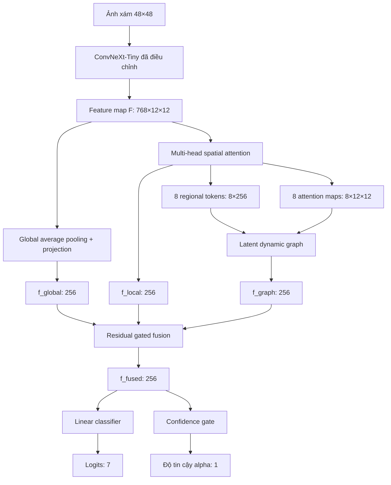

# Mô hình Attentive-SCN với suy luận đồ thị động tiềm ẩn cho nhận dạng biểu cảm khuôn mặt

> Phạm vi tài liệu: phiên bản `best-74.47`, commit `e05ada44`. Tài liệu này mô tả mô hình chính, không bao gồm các thử nghiệm M1 multi-scale, SE hoặc M2 region cross-attention.

## 1. Tóm tắt

Mô hình giải quyết bài toán nhận dạng biểu cảm khuôn mặt bảy lớp trên FER2013 từ ảnh xám kích thước 48 × 48. Kiến trúc chỉ sử dụng ảnh đầu vào, không cần facial landmark, bounding box vùng mặt, mặt nạ ngữ nghĩa hoặc bộ trích xuất vùng bên ngoài.

Mô hình gồm bốn thành phần chính:

1. ConvNeXt-Tiny đã điều chỉnh cho ảnh mặt độ phân giải thấp.
2. Spatial attention nhiều đầu để tự phát hiện các vùng biểu cảm mềm.
3. Latent dynamic graph để mô hình hóa quan hệ ngữ nghĩa và hình học giữa các vùng.
4. Self-Cure Network head để ước lượng đồng thời nhãn biểu cảm và độ tin cậy của từng mẫu.

Mốc accuracy cao nhất đã được lưu cho phiên bản này là **74,47%** trên tập test FER2013. Kết quả cho thấy mô hình có tính cạnh tranh trong nhóm phương pháp chỉ dùng ảnh, nhưng không nên được mô tả là state of the art.

## 2. Phát biểu bài toán

Với một ảnh khuôn mặt xám

$$
\mathbf{X}\in\mathbb{R}^{1\times48\times48},
$$

mục tiêu là dự đoán một trong bảy lớp

$$
\mathcal{Y}=\{\text{angry, disgust, fear, happy, sad, surprise, neutral}\}.
$$

FER2013 chứa ảnh có độ phân giải thấp, mất cân bằng lớp, biểu cảm mơ hồ và nhiễu nhãn. Vì vậy, mô hình vừa phải giữ được chi tiết không gian, vừa phải hạn chế ảnh hưởng của các mẫu không chắc chắn.

## 3. Kiến trúc tổng thể

Luồng tensor chính được tóm tắt như sau:

| Thành phần | Kích thước đầu ra |
|---|---:|
| Ảnh đầu vào | $B\times1\times48\times48$ |
| ConvNeXt feature map | $B\times768\times12\times12$ |
| Global descriptor | $B\times256$ |
| Spatial attention maps | $B\times8\times12\times12$ |
| Regional tokens | $B\times8\times256$ |
| Dynamic adjacency matrix | $B\times8\times8$ |
| Graph descriptor | $B\times256$ |
| Fused representation | $B\times256$ |
| Classification logits | $B\times7$ |
| Sample confidence | $B\times1$ |

## 4. Các thành phần của mô hình

### 4.1. ConvNeXt-Tiny cho ảnh 48 × 48

Backbone sử dụng ConvNeXt-Tiny được khởi tạo từ trọng số ImageNet. Hai thay đổi được áp dụng để tránh làm mất thông tin không gian quá sớm:

- Stem gốc $4\times4$, stride 4 được thay bằng convolution $3\times3$, stride 1.
- Downsampling cuối được thay bằng convolution $3\times3$, stride 1 để giữ feature map cuối ở kích thước 12 × 12.

Đối với ảnh xám một kênh, kernel RGB pretrained được lấy trung bình theo chiều kênh rồi nội suy từ $4\times4$ về $3\times3$. Backbone tạo feature map

$$
\mathbf{F}=\operatorname{ConvNeXt}(\mathbf{X}),\qquad
\mathbf{F}\in\mathbb{R}^{B\times768\times12\times12}.
$$

Tham khảo thiết kế ConvNeXt gốc tại [Liu et al., CVPR 2022](https://openaccess.thecvf.com/content/CVPR2022/html/Liu_A_ConvNet_for_the_2020s_CVPR_2022_paper.html).

### 4.2. Nhánh đặc trưng toàn cục

Nhánh toàn cục thực hiện global average pooling trên $\mathbf{F}$, sau đó chiếu từ 768 xuống 256 chiều:

$$
\mathbf{f}_{global}=operatorname{Dropout}\left(
\operatorname{GELU}\left(
\operatorname{LN}\left(
\mathbf{W}_{g}\operatorname{GAP}(\mathbf{F})
\right)\right)\right).
$$

Vector $\mathbf{f}_{global}\in\mathbb{R}^{B\times256}$ biểu diễn cấu trúc tổng quát của toàn khuôn mặt.

### 4.3. Spatial attention nhiều đầu

Nhánh local sử dụng tám attention head để tự tìm các vùng mang thông tin biểu cảm. Trước tiên, feature map được chiếu sang không gian giá trị 256 chiều:

$$
\mathbf{V}=\phi_v(\mathbf{F}),
\qquad
\mathbf{V}\in\mathbb{R}^{B\times256\times12\times12}.
$$

Một khối convolution sinh tám bản đồ attention thô. Softmax được áp dụng trên 144 vị trí không gian của từng head:

$$
A_{m,p}=\frac{\exp(S_{m,p})}
{\sum_{q=1}^{HW}\exp(S_{m,q})},
\qquad m=1,\ldots,8.
$$

Token vùng thứ $m$ được tính bằng weighted spatial pooling:

$$
\mathbf{h}_m=\sum_{p=1}^{HW}A_{m,p}\mathbf{V}_p,
\qquad
\mathbf{h}_m\in\mathbb{R}^{256}.
$$

Tám token được nối và chiếu về 256 chiều để tạo $\mathbf{f}_{local}$. Mô hình không gán cứng mỗi head cho mắt, mũi hoặc miệng; ý nghĩa vùng được học trực tiếp từ mục tiêu phân loại.

Để hạn chế nhiều head cùng tập trung vào một vị trí, diversity loss phạt độ tương tự cosine ngoài đường chéo giữa các attention map:

$$
\mathcal{L}_{div}=\frac{1}{B M(M-1)}
\sum_b\left\|\widehat{\mathbf{A}}_b
\widehat{\mathbf{A}}_b^{\top}-\mathbf{I}\right\|_F^2.
$$

### 4.4. Latent dynamic graph

Mỗi regional token $\mathbf{h}_m$ được xem là một node. Khác với đồ thị landmark cố định, graph của mô hình được xây dựng động cho từng ảnh.

#### Tâm không gian mềm

Từ attention map, mô hình tính tọa độ kỳ vọng của node:

$$
\mathbf{c}_m=
\left[
\sum_p A_{m,p}x_p,
\sum_p A_{m,p}y_p
\right],
\qquad \mathbf{c}_m\in[0,1]^2.
$$

#### Quan hệ ngữ nghĩa

Độ tương đồng giữa node $i$ và $j$ được tính bằng scaled dot product:

$$
s^{sem}_{ij}=\frac{(\mathbf{W}_q\mathbf{h}_i)^\top
(\mathbf{W}_k\mathbf{h}_j)}{\sqrt{D}}.
$$

#### Tiên nghiệm hình học

Các vùng gần nhau nhận một prior hình học lớn hơn:

$$
s^{geo}_{ij}=-|\lambda_{geo}|\left\|\mathbf{c}_i-\mathbf{c}_j\right\|_2^2,
$$

trong đó $\lambda_{geo}$ là tham số có thể học, khởi tạo bằng 2,0.

#### Ma trận kề động

Hai yếu tố được kết hợp để tạo adjacency theo từng hàng:

$$
A^{graph}_{ij}=\operatorname{softmax}_j
\left(s^{sem}_{ij}+s^{geo}_{ij}\right).
$$

Do đó, cạnh graph phản ánh đồng thời sự đồng xuất hiện về ngữ nghĩa và khoảng cách giữa các vùng trên khuôn mặt.

#### Message passing và graph readout

Thông điệp graph được tổng hợp bởi

$$
\mathbf{M}=\mathbf{A}^{graph}\mathbf{W}_v\mathbf{H}.
$$

Hai residual block cập nhật node:

$$
\mathbf{H}^{(1)}=\operatorname{LN}
\left(\mathbf{H}+\operatorname{Dropout}(\mathbf{M})\right),
$$

$$
\mathbf{H}^{(2)}=\operatorname{LN}
\left(\mathbf{H}^{(1)}+\operatorname{FFN}(\mathbf{H}^{(1)})\right).
$$

Cuối cùng, một attention gate học tầm quan trọng $\beta_m$ của từng node:

$$
\beta_m=\operatorname{softmax}_m(g(\mathbf{h}^{(2)}_m)),
\qquad
\mathbf{f}_{graph}=\sum_m\beta_m\mathbf{h}^{(2)}_m.
$$

Thiết kế này có liên hệ với tư tưởng gán trọng số động cho lân cận trong [Graph Attention Networks, ICLR 2018](https://arxiv.org/abs/1710.10903), nhưng adjacency ở đây được xây dựng riêng từ semantic similarity và spatial prior.

### 4.5. Hợp nhất đặc trưng

Đầu tiên, đặc trưng local và graph được cộng lại:

$$
\mathbf{f}_{rep}=\mathbf{f}_{local}+\mathbf{f}_{graph}.
$$

Một scalar gate có thể học điều chỉnh đóng góp của nhánh vùng:

$$
g=\sigma(\theta_g), \qquad \theta_g=0.5\text{ tại khởi tạo},
$$

$$
\mathbf{f}_{fused}=\operatorname{LN}
\left(\mathbf{f}_{global}+g\mathbf{f}_{rep}\right).
$$

Giá trị gate ban đầu xấp xỉ $\sigma(0.5)=0.622$. Cấu trúc residual giúp duy trì nhánh toàn cục trong khi bổ sung thông tin quan hệ giữa các vùng.

### 4.6. Self-Cure head

Từ $\mathbf{f}_{fused}$, mô hình tạo hai đầu ra.

Đầu phân loại tuyến tính:

$$
\mathbf{z}=\mathbf{W}_2\operatorname{GELU}
\left(\mathbf{W}_1\operatorname{Dropout}(\mathbf{f}_{fused})\right),
\qquad \mathbf{z}\in\mathbb{R}^{7}.
$$

Đầu confidence dự đoán độ tin cậy của mẫu:

$$
\alpha=0.10+0.90\cdot\sigma(g_{conf}(\mathbf{f}_{fused})).
$$

Khoảng $[0.10,1.00]$ ngăn confidence suy giảm về 0 hoàn toàn. Bias cuối được khởi tạo bằng 1,5 để mô hình bắt đầu bằng trạng thái tương đối tin tưởng dữ liệu. Ý tưởng xử lý uncertainty được xây dựng dựa trên [Self-Cure Network, CVPR 2020](https://openaccess.thecvf.com/content_CVPR_2020/papers/Wang_Suppressing_Uncertainties_for_Large-Scale_Facial_Expression_Recognition_CVPR_2020_paper.pdf), nhưng implementation hiện tại tắt dynamic relabeling để hạn chế confirmation bias.

## 5. Hàm mục tiêu

### 5.1. Cross-entropy hai neo

Gọi $\ell_i$ là cross-entropy có label smoothing của mẫu $i$. Loss cơ sở là

$$
\mathcal{L}_{base}=\frac{1}{B}\sum_i\ell_i.
$$

Loss có trọng số confidence là

$$
\mathcal{L}_{weighted}=
\frac{\sum_i\operatorname{stopgrad}(\alpha_i)\ell_i}
{\sum_i\operatorname{stopgrad}(\alpha_i)+\epsilon}.
$$

Confidence được detach trong nhánh classification để ngăn nghiệm suy biến $\alpha\rightarrow0$. Classification loss kết hợp hai neo:

$$
\mathcal{L}_{cls}=0.5\mathcal{L}_{base}+0.5\mathcal{L}_{weighted}.
$$

### 5.2. Rank regularization

Sau năm epoch warm-up, các mẫu được sắp theo $\ell_i$. 70% mẫu có loss thấp nhất được xem là nhóm clean tương đối; phần còn lại là nhóm uncertain:

$$
\mathcal{L}_{rank}=\max\left(0,
\gamma-(\bar{\alpha}_{clean}-\bar{\alpha}_{uncertain})\right),
$$

với margin $\gamma=0.15$.

### 5.3. Tổng loss

$$
\mathcal{L}=\mathcal{L}_{cls}
+0.10\mathcal{L}_{rank}
+0.05\mathcal{L}_{div}
+0.00\mathcal{L}_{sparsity}.
$$

Khi Mixup hoạt động, mô hình dùng Mixup cross-entropy và tạm tắt confidence weighting cùng rank loss vì nhãn lúc này là nhãn tổng hợp.

## 6. Cấu hình huấn luyện đã sử dụng

| Thuộc tính | Giá trị |
|---|---:|
| Input | 48 × 48, grayscale |
| Backbone | ConvNeXt-Tiny, ImageNet pretrained |
| Embedding dimension | 256 |
| Số spatial head / graph node | 8 |
| Batch size | 64 |
| Optimizer | AdamW |
| Learning rate | $3\times10^{-4}$ |
| Weight decay | 0.002 |
| Scheduler | Cosine annealing |
| Minimum learning rate | $10^{-6}$ |
| Label smoothing | 0.05 |
| Dropout | 0.30 |
| Epoch tối đa | 200 |
| Early-stopping patience | 30 |
| EMA | 0.999 |
| Gradient clipping | 2.0 |
| Class weighting | Căn bậc hai của nghịch đảo tần suất |
| Mixup | $\alpha=0.2$, xác suất 0.5 |
| Random erasing | Xác suất 0.30 |
| Checkpoint criterion | Accuracy × macro-F1 trên validation |

Data augmentation còn gồm horizontal flip và random affine với góc quay tối đa 10°, dịch chuyển 8% và scale trong khoảng $[0.92,1.08]$. Validation sử dụng exponential moving average của tham số mô hình và flip TTA.

## 7. Độ phức tạp tham số

| Thành phần | Số tham số |
|---|---:|
| ConvNeXt backbone | 29,289,408 |
| Global projector | 197,376 |
| Multi-head spatial attention | 3,380,232 |
| Latent dynamic graph | 477,058 |
| Fusion LayerNorm | 512 |
| Fusion scalar gate | 1 |
| SCN head | 50,312 |
| **Tổng cộng** | **33,394,899** |

Khoảng 87,7% tham số nằm trong backbone. Spatial attention là phần mở rộng lớn nhất ngoài backbone; latent graph chỉ chiếm khoảng 1,43% tổng số tham số.

## 8. Kết quả đã ghi nhận

| Thiết lập | Validation accuracy | Validation macro-F1 | Test accuracy | Test macro-F1 |
|---|---:|---:|---:|---:|
| Checkpoint tốt nhất trong log, epoch 20 | 73.81% | 72.01% | — | — |
| Weighted flip TTA, trọng số original/flip = 0.8/0.2 | 73.98% | 71.98% | 74.28% | 73.67% |
| Mốc tốt nhất lưu tại branch `best-74.47` | — | — | **74.47%** | Chưa có trong log cung cấp |

Không nên điền macro-F1 cho mốc 74,47% bằng giá trị của một lần đánh giá khác. Khi viết bản cuối, cần truy xuất đúng checkpoint và xuất lại accuracy, macro-F1, balanced accuracy, confusion matrix và per-class recall trong cùng một lần chạy.

Các phương pháp gần đây đã báo cáo 76,12% với [EmoNeXt](https://arxiv.org/abs/2501.08199) và 76,18% với [SFER-MDFAE](https://pubmed.ncbi.nlm.nih.gov/39460228/) trên FER2013. Vì vậy, 74,47% nên được mô tả là kết quả cạnh tranh của một mô hình image-only, không phải SOTA.

## 9. Điểm mạnh và giới hạn

### Điểm mạnh

- Không phụ thuộc landmark, bounding box hoặc semantic mask.
- Regional token có khả năng diễn giải thông qua attention map.
- Graph được xây dựng riêng cho từng ảnh thay vì dùng topology cố định.
- Quan hệ graph kết hợp nội dung biểu cảm và vị trí không gian.
- Confidence head giảm ảnh hưởng của mẫu khó hoặc có khả năng nhiễu nhãn.
- Baseline, attention, graph và SCN có thể tắt độc lập để thực hiện ablation.

### Giới hạn

- Accuracy 74,47% chưa vượt các kết quả FER2013 mạnh gần đây.
- Kết quả hiện tại chủ yếu dựa trên một seed; chưa đủ để chứng minh cải thiện có ý nghĩa thống kê.
- Soft attention không bảo đảm mỗi head tương ứng với một facial action unit cụ thể.
- Graph là latent graph, không có supervision trực tiếp cho node hoặc edge.
- FER2013 có nhãn mơ hồ; accuracy đơn lẻ không phản ánh đầy đủ chất lượng mô hình.
- Dynamic relabeling của SCN đang tắt, nên mô hình chỉ sử dụng confidence weighting và rank regularization.

## 10. Cách trình bày đóng góp trong paper

Có thể mô tả đóng góp theo hướng thận trọng như sau:

1. Đề xuất một pipeline FER chỉ dùng ảnh, trong đó spatial attention sinh ra các regional token mà không cần landmark supervision.
2. Xây dựng latent dynamic graph kết hợp semantic co-activation và khoảng cách giữa tâm attention để suy luận quan hệ giữa các vùng biểu cảm.
3. Tích hợp confidence-aware self-curing objective nhằm giảm ảnh hưởng của biểu cảm mơ hồ và nhãn không chắc chắn.
4. Thực hiện ablation có kiểm soát để đánh giá riêng global stream, spatial attention, graph reasoning và SCN.

Không nên tuyên bố từng thành phần ConvNeXt, spatial attention, graph neural network hoặc SCN là hoàn toàn mới. Tính mới cần được đặt ở cách hình thành node mềm, công thức adjacency hai yếu tố và cách tích hợp chúng thành một pipeline landmark-free.

## 11. Ablation cần có trước khi nộp paper

| Thí nghiệm | Spatial attention | Latent graph | SCN | Acc | Macro-F1 | Params |
|---|:---:|:---:|:---:|---:|---:|---:|
| ConvNeXt-only | ✗ | ✗ | ✗ | cần chạy | cần chạy | cần đo |
| ConvNeXt + attention | ✓ | ✗ | ✗ | cần chạy | cần chạy | cần đo |
| ConvNeXt + attention + graph | ✓ | ✓ | ✗ | cần chạy | cần chạy | cần đo |
| Mô hình đầy đủ | ✓ | ✓ | ✓ | 74.47%* | cần xác minh | 33.39M |

\* Mốc từ branch hiện tại; cần báo cáo trung bình và độ lệch chuẩn của ít nhất ba seed.

Ngoài accuracy, paper nên có:

- Mean ± standard deviation trên tối thiểu ba seed.
- Macro-F1, balanced accuracy, precision và recall từng lớp.
- Confusion matrix của đúng checkpoint được báo cáo.
- FLOPs, latency và throughput trên cùng phần cứng.
- Attention-map visualization và latent adjacency visualization.
- So sánh có/không geometric prior.
- So sánh 4, 8 và 12 attention head nếu ngân sách thực nghiệm cho phép.
- Đánh giá thêm trên FERPlus hoặc RAF-DB để kiểm tra khả năng tổng quát.

## 12. Đoạn Methodology rút gọn có thể chỉnh sửa cho paper

> Chúng tôi xây dựng một kiến trúc nhận dạng biểu cảm chỉ sử dụng ảnh, gồm backbone ConvNeXt-Tiny, bộ khám phá vùng mềm và mô-đun suy luận đồ thị động tiềm ẩn. ConvNeXt được điều chỉnh để duy trì feature map 12 × 12 đối với ảnh FER2013 kích thước 48 × 48. Từ feature map cuối, một nhánh toàn cục sinh biểu diễn toàn khuôn mặt, trong khi spatial attention nhiều đầu tạo tám regional token cùng các phân phối chú ý tương ứng. Mỗi token được xem là một node tiềm ẩn. Trọng số cạnh được suy ra động bằng tổng của độ tương đồng ngữ nghĩa và một spatial prior dựa trên khoảng cách giữa tâm chú ý. Sau message passing có residual connection, attention readout tổng hợp các node thành graph descriptor. Global, local và graph descriptor được hợp nhất bằng một residual gate có thể học. Cuối cùng, Self-Cure head đồng thời dự đoán lớp biểu cảm và confidence của mẫu; rank regularization khuyến khích confidence của nhóm loss thấp lớn hơn nhóm uncertain. Toàn bộ hệ thống được huấn luyện end-to-end mà không cần landmark hoặc annotation vùng.

## 13. Tài liệu tham khảo chính

1. I. J. Goodfellow et al., “Challenges in Representation Learning: A Report on Three Machine Learning Contests,” ICML Workshop, 2013. [arXiv](https://arxiv.org/abs/1307.0414)
2. Z. Liu et al., “A ConvNet for the 2020s,” CVPR, 2022, pp. 11976–11986. [CVF Open Access](https://openaccess.thecvf.com/content/CVPR2022/html/Liu_A_ConvNet_for_the_2020s_CVPR_2022_paper.html)
3. K. Wang et al., “Suppressing Uncertainties for Large-Scale Facial Expression Recognition,” CVPR, 2020. [CVF Open Access](https://openaccess.thecvf.com/content_CVPR_2020/html/Wang_Suppressing_Uncertainties_for_Large-Scale_Facial_Expression_Recognition_CVPR_2020_paper.html)
4. P. Veličković et al., “Graph Attention Networks,” ICLR, 2018. [arXiv](https://arxiv.org/abs/1710.10903)
5. Y. El Boudouri and A. Bohi, “EmoNeXt: an Adapted ConvNeXt for Facial Emotion Recognition,” 2025. [arXiv](https://arxiv.org/abs/2501.08199)
6. “A Student Facial Expression Recognition Model Based on Multi-Scale and Deep Fine-Grained Feature Attention Enhancement,” 2024. [PubMed](https://pubmed.ncbi.nlm.nih.gov/39460228/)

